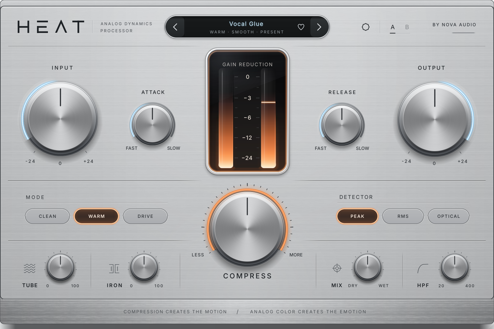

# HEAT — Analog Dynamics Processor

*Compression creates the motion. Analog colour creates the emotion.*

HEAT is a single-screen compressor plug-in (VST3 / Standalone, AU on macOS)
built with C++20 and JUCE 8. The front panel exposes a handful of controls —
INPUT, COMPRESS, ATTACK, RELEASE, OUTPUT, plus MODE, DETECTOR, TUBE, IRON,
MIX and HPF — while the engine underneath runs a calibrated feed-forward
compressor with three detectors, program-dependent release, three
character modes and oversampled, level-compensated colour stages.



The editor is drawn entirely in code to match the locked visual reference
(`design/reference/HEAT_LOCKED_REFERENCE.png`); see
`design/fidelity/REFERENCE_vs_RENDER.png` for a side-by-side.

## Building

Requirements: CMake ≥ 3.22, a C++20 compiler (GCC 11+, Clang 14+, MSVC 2022,
Xcode 14+). On Linux, the usual JUCE dependencies (X11, Xrandr, Xinerama,
Xcursor, freetype, fontconfig, ALSA, curl headers).

```bash
# JUCE 8.0.15 is fetched automatically…
cmake -S . -B build -G Ninja -DCMAKE_BUILD_TYPE=Release
# …or point at a local checkout:
cmake -S . -B build -G Ninja -DCMAKE_BUILD_TYPE=Release -DHEAT_JUCE_DIR=/path/to/JUCE

cmake --build build --parallel
```

Artefacts:

| Format | Path |
|---|---|
| VST3 | `build/HEAT_artefacts/Release/VST3/HEAT.vst3` |
| Standalone | `build/HEAT_artefacts/Release/Standalone/HEAT` |
| AU (macOS only) | `build/HEAT_artefacts/Release/AU/HEAT.component` |

Options: `HEAT_BUILD_TESTS` (ON), `HEAT_BUILD_TOOLS` (ON, snapshot renderer),
`HEAT_SANITIZE` (ASan + UBSan), `HEAT_SANITIZE_THREAD` (TSan).

## Testing

```bash
./build/heat_dsp_tests                                    # 55 DSP tests (JUCE-free)
xvfb-run -a ./build/heat_plugin_tests_artefacts/Release/heat_plugin_tests   # 15 plugin tests
./build/heat_measure docs/measurements                    # CSV + WAV measurements, CPU profile
xvfb-run -a ./build/heat_snapshot_artefacts/Release/heat_snapshot out.png 1.0 -3.66
```

See [`docs/TESTING.md`](docs/TESTING.md) for what each suite proves, and the
quality gates in [`docs/CLEAN_QUALITY_GATE.md`](docs/CLEAN_QUALITY_GATE.md) and
[`docs/ANALOG_QUALITY_GATE.md`](docs/ANALOG_QUALITY_GATE.md).

## Repository map

| Path | Contents |
|---|---|
| `Source/DSP` | JUCE-free engine: gain computer, detectors, ballistics, COMPRESS macro, compressor, sidechain HPF, full signal chain (`HeatEngine`) |
| `Source/Modes` | CLEAN / WARM / DRIVE and PEAK / RMS / OPTICAL profiles |
| `Source/Nonlinear` | TUBE, IRON, mode colour, DC blocking, saturation primitives |
| `Source/Quality` | Polyphase half-band oversampler (2x / 4x / 8x) |
| `Source/Core` | Parameters (stable IDs), presets, A/B state |
| `Source/UI`, `Source/Graphics` | Custom editor, knobs, meter, selectors, header, advanced panel, chassis painter |
| `Tests` | DSP, plugin, realtime and concurrency tests |
| `Tools` | `heat_measure` (measurements) and `heat_snapshot` (headless UI renderer) |
| `docs` | Specification, architecture, models, quality gates, development log |

## Fonts

The UI embeds **Inter** (© The Inter Project Authors, SIL Open Font License
1.1 — see `Resources/Fonts/Inter-OFL-LICENSE.txt`).
